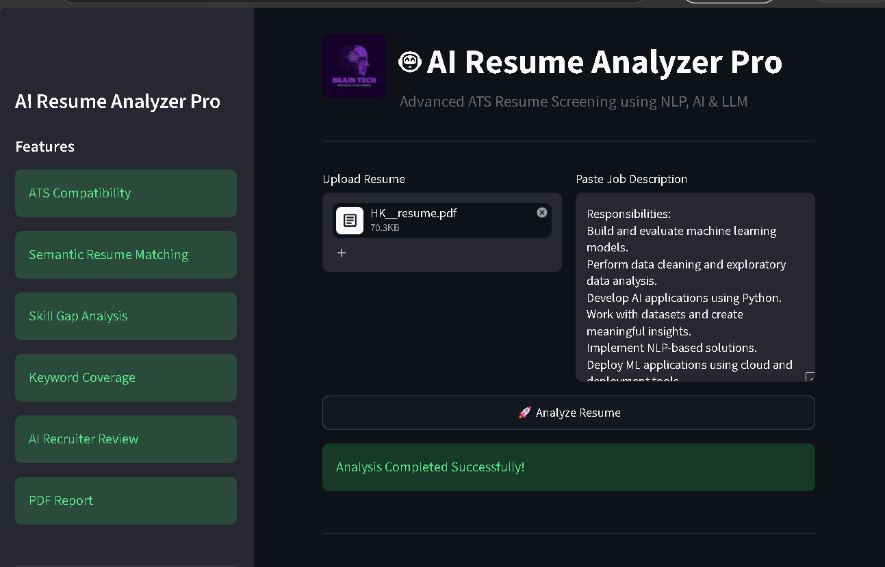
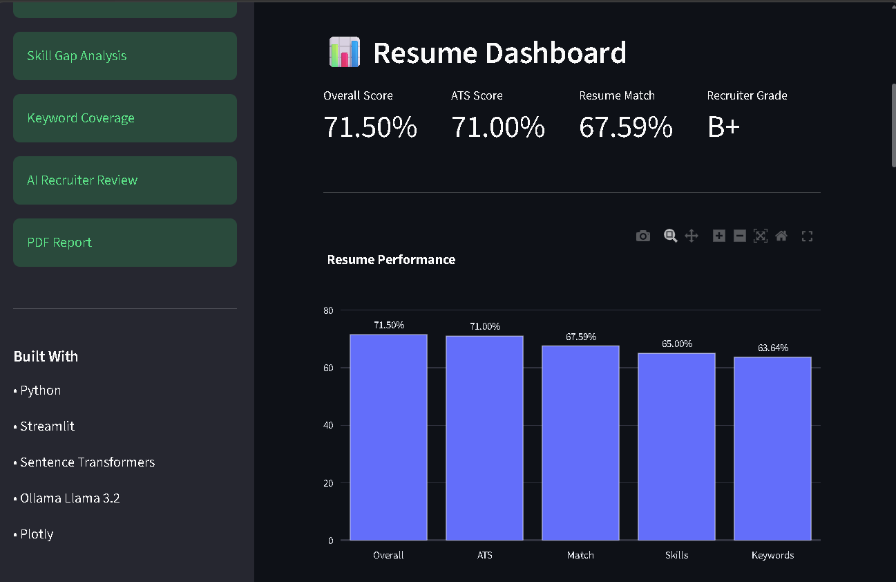
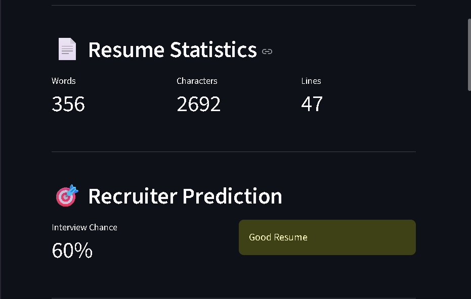

# 🤖 AI Resume Analyzer

An advanced AI-powered ATS Resume Screening System that analyzes resumes using **Natural Language Processing (NLP), Semantic Matching, and LLM-based recruiter insights**.

The system helps job seekers understand how well their resume matches a job description and provides actionable improvement suggestions.

---

## 🚀 Features

### 📊 ATS Compatibility Analysis
- ATS score calculation
- Resume structure evaluation
- Job description keyword matching
- ATS optimization feedback

### 🧠 AI Resume Matching
- Semantic similarity analysis using Sentence Transformers
- Resume vs Job Description comparison
- Intelligent matching beyond simple keyword search

### 🛠 Skill Gap Analysis
- Extracts technical skills from resumes
- Identifies matched and missing skills
- Provides skill improvement recommendations

### 🔑 Keyword Analysis
- Required keyword extraction
- Keyword coverage percentage
- Missing keyword detection

### 🤖 AI Recruiter Review
- LLM-based resume feedback
- Resume strengths analysis
- Improvement suggestions

### 🎯 Career Insights
- Recruiter grade prediction
- Interview probability estimation
- Recommended job roles

### 📄 Report Generation
- Downloadable PDF resume analysis report

---

# 🏗 System Architecture
Resume Upload
|
↓
Resume Text Extraction
|
↓
Skill & Keyword Extraction
|
↓
ATS Compatibility Engine
|
↓
Semantic Resume Matching
|
↓
AI Recruiter Review
|
↓
PDF Report Generation


---

# 🛠 Tech Stack

## Programming
- Python

## Framework
- Streamlit

## AI / NLP
- Sentence Transformers
- Scikit-learn
- Ollama Llama 3.2

## Data Processing
- Pandas
- NumPy

## Visualization
- Plotly

## Document Processing
- PDF/Text Extraction

---

# 📂 Project Structure


AI-Resume-Analyzer

│
├── analyzer/
│ ├── ats.py
│ ├── matcher.py
│ ├── skills.py
│ ├── keywords.py
│ ├── scoring.py
│ ├── llm.py
│ ├── report.py
│ └── recommendation.py
│
├── assets/
│
├── docs/
│
├── screenshots/
│
├── app.py
│
├── requirements.txt
│
├── test_ats.py
│
└── test_score.py


---

# ⚙️ Installation

Clone the repository:

```bash
git clone https://github.com/haneya1003/AI-Resume-Analyzer.git

Navigate to the project folder:

cd AI-Resume-Analyzer

Create virtual environment:

python -m venv venv

Activate environment:

Windows:

venv\Scripts\activate

Install dependencies:

pip install -r requirements.txt

Run application:

streamlit run app.py

---
## 📸 Screenshots

### Resume Upload



### Resume Dashboard



### Analysis Results



---

# 🧪 Testing

ATS Engine Test:

```bash

python test_ats.py

Score Pipeline Test:

python test_score.py

📈 Example Analysis Output

The system provides:

Overall Resume Score
ATS Compatibility Score
Resume Match Percentage
Skill Coverage
Keyword Coverage
Recruiter Grade
Interview Probability
AI Feedback

🎯 Future Improvements
Real-time job portal integration
Resume improvement generator
Multi-language resume support
Advanced recruiter ranking model
Cloud deployment

👩‍💻 Author
Haneya
BSc Artificial Intelligence

⭐ If you find this project useful, consider giving it a star!


After saving the README:

Open terminal and run:

```powershell

git add README.md

then:

git commit -m "Add professional README documentation"

then:

git push